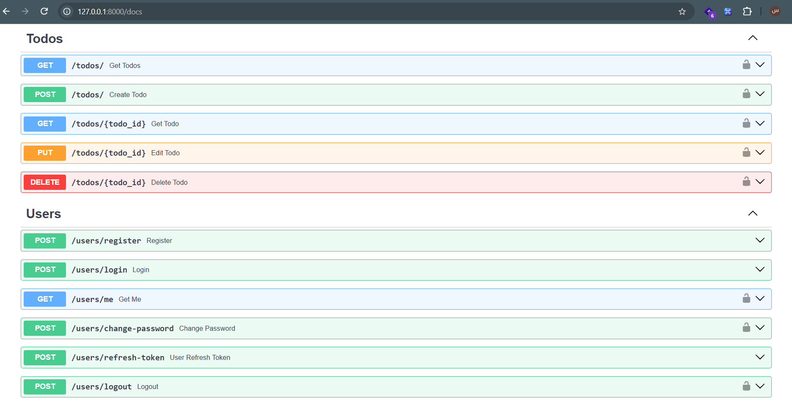

# FastAPI Todo Service

A RESTful Todo API built with **FastAPI**, **SQLAlchemy**, **Pydantic**, and **JWT authentication**.

This project provides user authentication and a complete Todo management system with filtering, searching, pagination, sorting, password management, and token-based authentication.

## Swagger Preview



## Features

- User registration and login
- Secure password hashing with bcrypt
- JWT-based authentication
- Access and refresh tokens
- Token revocation on logout
- Get authenticated user information
- Change password
- Create, read, update, and delete Todos
- User-specific Todo access
- Search Todos by title and description
- Filter Todos by completion status
- Pagination with `skip` and `limit`
- Sort Todos by ID, title, or completion status
- Ascending and descending sorting
- Request validation with Pydantic
- SQLAlchemy ORM
- Automatic API documentation with Swagger and ReDoc

## Tech Stack

- **Python**
- **FastAPI**
- **SQLAlchemy**
- **Pydantic**
- **PyJWT**
- **Passlib / bcrypt**
- **SQLite**
- **Uvicorn**
- **Alembic**

## Authentication

The API uses JWT tokens for authentication.

After a successful login, the API returns:

- **Access Token**: valid for 1 hour
- **Refresh Token**: valid for 24 hours

Protected endpoints require the access token using the HTTP Bearer authentication scheme.

```text
Authorization: Bearer <access_token>
```

Access tokens contain a unique `jti`, which is stored in the revoked-token table when a user logs out. This prevents a logged-out access token from being used again.

## API Endpoints

### Authentication & Users

| Method | Endpoint | Description | Authentication |
|--------|----------|-------------|----------------|
| `POST` | `/users/register` | Register a new user | No |
| `POST` | `/users/login` | Login and receive tokens | No |
| `GET` | `/users/me` | Get current user information | Yes |
| `POST` | `/users/change-password` | Change current password | Yes |
| `POST` | `/users/refresh-token` | Generate a new access token | No |
| `POST` | `/users/logout` | Revoke the current access token | Yes |

### Todos

| Method | Endpoint | Description | Authentication |
|--------|----------|-------------|----------------|
| `GET` | `/todos/` | Get user's Todos | Yes |
| `POST` | `/todos/` | Create a Todo | Yes |
| `GET` | `/todos/{todo_id}` | Get a specific Todo | Yes |
| `PUT` | `/todos/{todo_id}` | Update a Todo | Yes |
| `DELETE` | `/todos/{todo_id}` | Delete a Todo | Yes |

## Todo Query Parameters

The Todo list endpoint supports filtering, searching, pagination, and sorting.

### Filter by completion status

```text
GET /todos/?is_completed=true
```

### Search

Search through both the title and description:

```text
GET /todos/?search=python
```

### Pagination

```text
GET /todos/?skip=0&limit=10
```

The API accepts:

- `skip`: starting offset
- `limit`: number of results, from 1 to 20

### Sorting

Available fields:

- `id`
- `title`
- `is_completed`

Example:

```text
GET /todos/?sort_by=title&sort_order=asc
```

Supported sort orders:

- `asc`
- `desc`

These parameters can also be combined:

```text
GET /todos/?is_completed=false&search=project&skip=0&limit=10&sort_by=title&sort_order=asc
```

## Data Validation

Request data is validated using Pydantic models.

For example, user passwords must contain between 8 and 72 characters, while Todo titles and descriptions have defined length limits.

The change-password endpoint also validates that the new password and its confirmation match.

## Project Structure

```text
FastAPI-Todo-Service/
│
├── auth/
│   └── jwt_auth.py
│
├── core/
│   ├── config.py
│   └── database.py
│
├── messages/
│   ├── accounts.py
│   └── todos.py
│
├── models/
│   ├── todo.py
│   └── user.py
│
├── routers/
│   ├── todos.py
│   └── users.py
│
├── schemas/
│   ├── todo.py
│   └── user.py
│
├── main.py
├── todo.db
└── requirements.txt
```

### Main Components

**`auth/`**  
JWT token generation, validation, authentication, and token revocation.

**`core/`**  
Application configuration and database connection/session management.

**`models/`**  
SQLAlchemy database models for users, Todos, and revoked tokens.

**`routers/`**  
API endpoints for authentication, users, and Todos.

**`schemas/`**  
Pydantic schemas used for request validation and API responses.

**`messages/`**  
Centralized response and error messages.

## Environment Variables

Create a `.env` file in the project root:

```env
DATABASE_URL=sqlite:///./todo.db
AUTH_JWT_SECRET_KEY=your-secret-key
```

`AUTH_JWT_SECRET_KEY` should be replaced with a strong, randomly generated secret in a production environment.

## Installation

Clone the repository:

```bash
git clone https://github.com/SAEED-ESK/FastAPI-Todo-Service.git
cd FastAPI-Todo-Service
```

Create and activate a virtual environment:

```bash
python -m venv venv
```

Windows:

```bash
venv\Scripts\activate
```

Linux / macOS:

```bash
source venv/bin/activate
```

Install dependencies:

```bash
pip install -r requirements.txt
```

Create the `.env` file and configure the required environment variables.

## Run the Application

Start the development server with Uvicorn:

```bash
uvicorn main:app --reload
```

The API will be available at:

```text
http://127.0.0.1:8000
```

## API Documentation

FastAPI automatically provides interactive API documentation.

### Swagger UI

```text
http://127.0.0.1:8000/docs
```

### ReDoc

```text
http://127.0.0.1:8000/redoc
```

## Database

The project uses **SQLite** with **SQLAlchemy ORM**.

The database contains separate models for:

- Users
- Todos
- Revoked JWT tokens

Each Todo is associated with its owner through a foreign-key relationship, ensuring that authenticated users can only access and modify their own Todos.

## Authentication Flow

```text
Register
   │
   ▼
Login
   │
   ├── Access Token
   │
   └── Refresh Token
          │
          ▼
     Refresh Access Token
```

For protected endpoints:

```text
Client
  │
  │ Bearer Access Token
  ▼
FastAPI
  │
  ├── Validate JWT
  ├── Check token type
  ├── Check token revocation
  └── Identify user
          │
          ▼
     Protected Resource
```

## Project Purpose

This project was built to practice designing a backend REST API with FastAPI and implementing common backend concepts including authentication, authorization, database relationships, validation, pagination, filtering, sorting, and token management.
